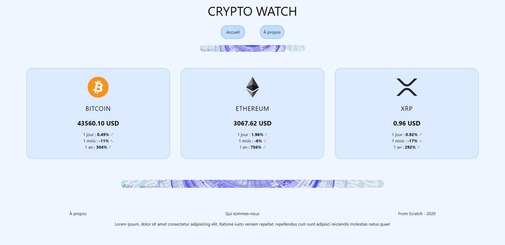

# CRYPTO WATCH

Realized by following a tutorial on Youtube by Fromscratch.  
Link to the [video tutoriel](https://www.youtube.com/watch?v=Lw5_KQR8zwk&list=PLEiMYEzpB4QuzEG3vVsmD87nXyn7ohHpb&index=9).

📅 started in September 2021  
✅ finish

## Why ?

To learn [Next.js](https://nextjs.org/learn) and [Tailwindcss](https://tailwindcss.com/).



## Get the Code

```
$ git clone https://github.com/frmi2018/crypto-watch.git
```

## Getting Started

First, run the development server:

```bash
npm run dev
# or
yarn dev
```

Open [http://localhost:3000](http://localhost:3000) with your browser to see the result.
